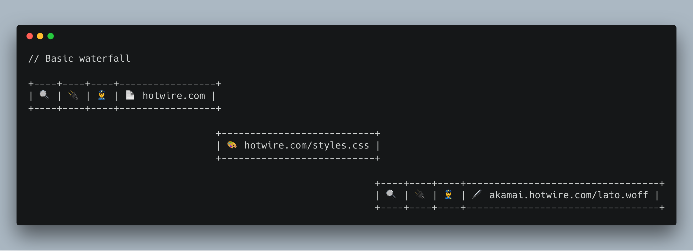
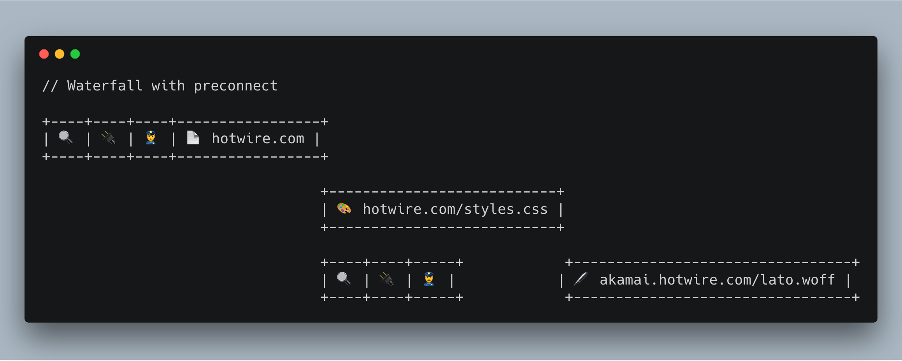
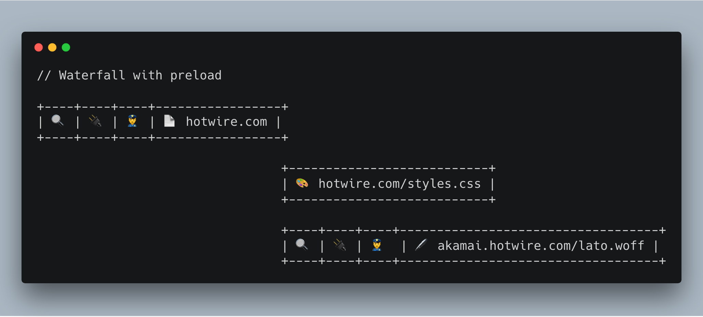
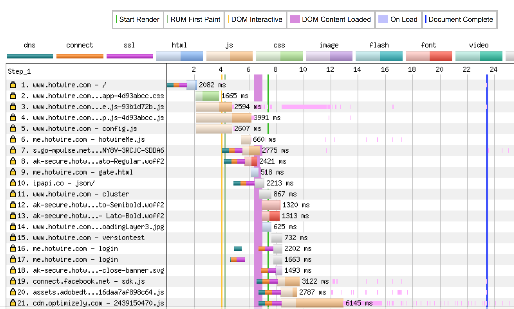
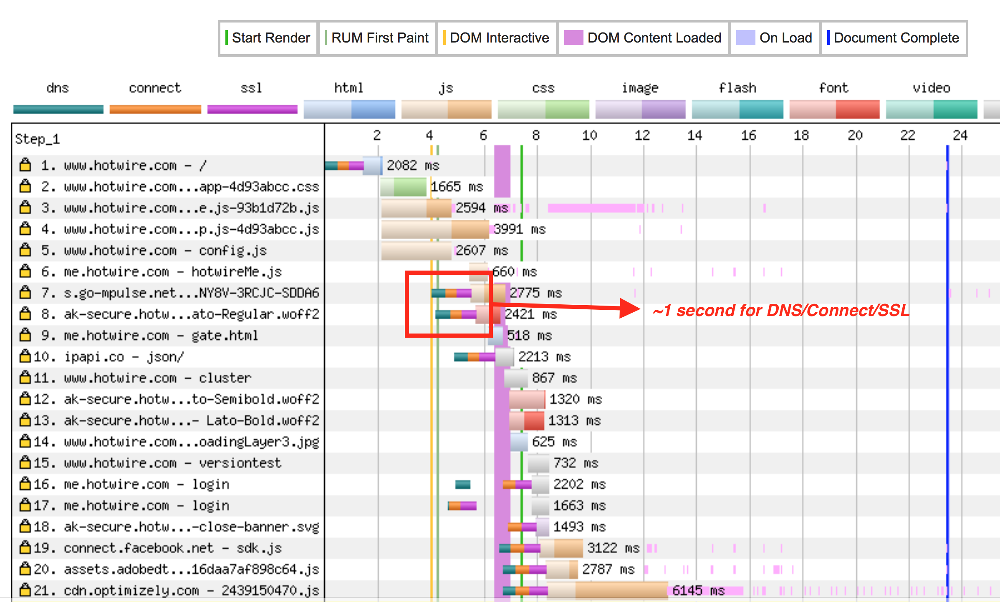
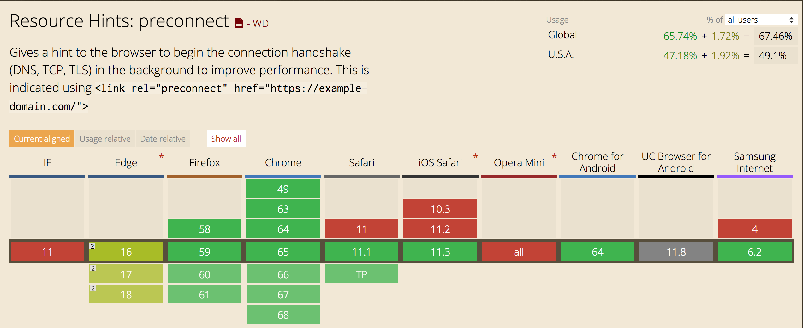
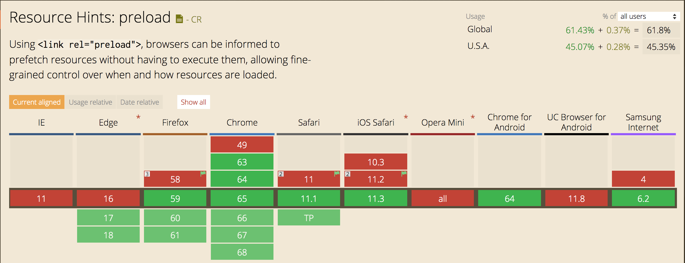

# Using preconnect and preload to improve our webpage speed

> Look at the `demo` directory for an example using `preload`

Let's take a look at a basic HTML page. There is an HTML file, a CSS file, and a request to a font file hosted on akamai.

``` html
<!-- index.html -->
<html>
    <head>
        <link href="./styles.css" rel="stylesheet" type="text/css">
    </head>
</html>
```

``` css
/* styles.css */
@import url('https://akamai.hotwire.com/lato.woff');

body {
    font-family: Lato;
}
```

Let's look at the network waterfall for this webpage.

| Term | Symbol |
| --- | --- |
| dns | 🔍 |
|connect | 🔌 |
| ssl | 👮 |



For each domain, our browser does a DNS search, connects to the server, and sets up a secure connection. This can lead to very long waterfalls.

We can shorten our waterfalls by using a `preconnect`. 



# What does the code look like?

``` html
<html>
    <link href="akamai.hotwire.com" rel="preconnect" /> 
    <link href="./styles.css" rel="stylesheet" type="text/css" />
</html>
```

There are other options, such as `preload` where you know the name of the asset.



# Real Waterfall
[WebpageTest](https://www.webpagetest.org/result/180410_RQ_28bffb7761ca5a17071e157957cd3ac4/) for hotwire.com



By doing the connection to `akamai` earlier, we should be able to finish loading our page faster.



# Browser support
[](https://caniuse.com/#search=preconnect)
[](https://caniuse.com/#search=preload)