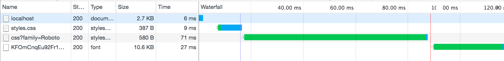
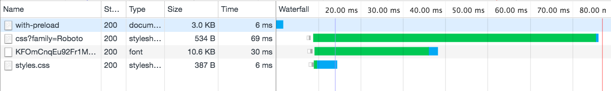

# Preload demonstration

# Getting started
``` shell
npm install
# Download dependencies

npm start
# Run server

open localhost:3000
# Look at network tab for demo

open localhost:3000/with-preload
# Look at network tab for demo with preload
```

# Waterfall without preload


# Waterfall with preload
